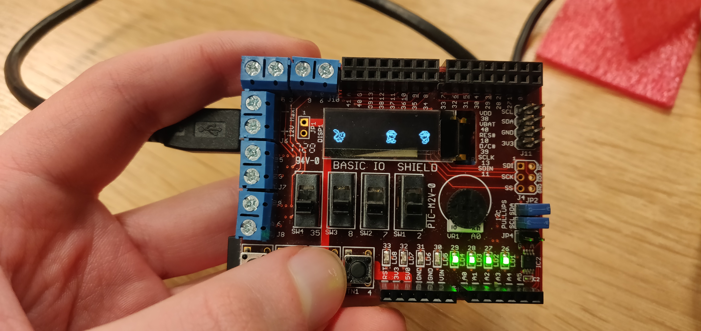
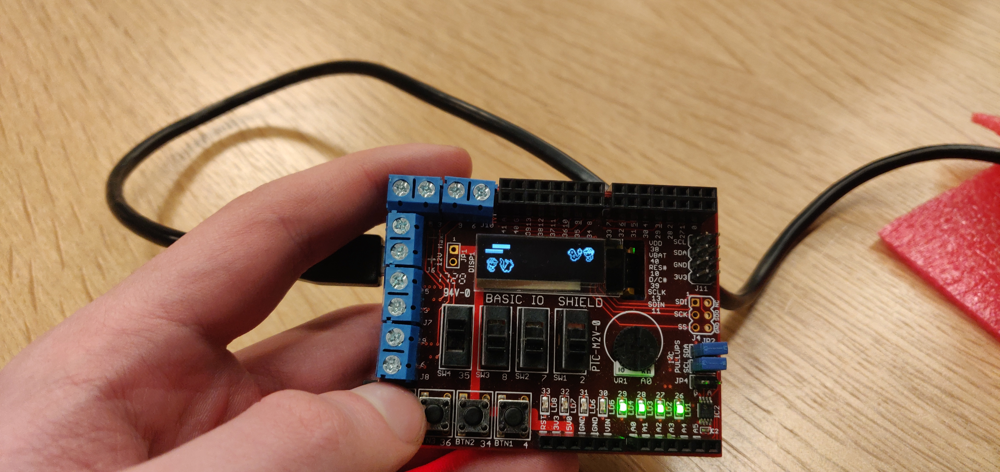
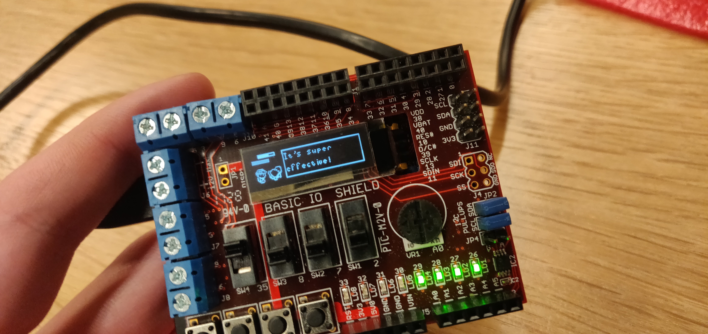

# Embedded Pokémon
As part of a course on computer engineering and hardware components,
a small Pokémon-like game was developed. 

It ran on a ChipKit Uno32 microcontroller with a MIPS architecture, using a basic 
I/O shield. All graphics were presented on a 128*32 pixel black and white screen and 8 LED lights, indicating the number of Pokémon the player had remaining. 
Input was limited to 4 buttons and 4 switches.

The game had an overworld in which a player character could walk around in 8 directions and interact 
with trainers and Pokémon, as well as a battle mode where the player battles another 
trainer. The player had an inventory with items and Pokémon on which these could be used.

My responsibilities included creating easy to use sprite- and text-rendering functionality, 
simple animations, and interaction with overworld elements.